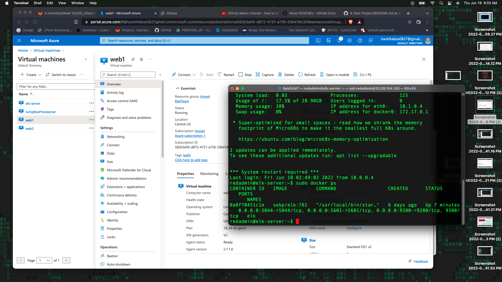

# Project1-UPenn
 Elk stack
## Automated ELK Stack Deployment

The files in this repository were used to configure the network depicted below.

These files have been tested and used to generate a live ELK deployment on Azure. They can be used to either recreate the entire deployment pictured above. Alternatively, select portions of the yml file may be used to install only certain pieces of it, such as Filebeat.

DVWA-playbook.yml used to install DVWA web servers.

This document contains the following details:
- Description of the Topologu
- Access Policies
- ELK Configuration
  - Beats in Use
  - Machines Being Monitored
- How to Use the Ansible Build

### Description of the Topology

The main purpose of this network is to expose a load-balanced and monitored instance of DVWA, the D*mn Vulnerable Web Application.

Load balancing ensures that the application will be highly available, in addition to restricting unwanted access to the network.

A Load Balancer can help reduce so DoS attacks.  The Load Balancer will do this buy balancing the load across multiple web application servers.

A JumpBox acts as a single point of entry to an protected network that is exposed to the public. It is a machine in front of other machines that are not exposed to the internet. 

Integrating an ELK server allows users to easily monitor the vulnerable VMs for changes to the machine metrics and system logs.

Filbert is used to gather file locations or system logs you choose to the elk server.

Metricbeat is used to record the machine metrics on Mac, Linux, or Windows hosts then sends to elk server to track system. 

The configuration details of each machine may be found below.
_Note: Use the [Markdown Table Generator](http://www.tablesgenerator.com/markdown_tables) to add/remove values from the table_.

| Name     | Function | IP Address | Operating System |
|----------|----------|------------|------------------|
| Jump Box | Gateway  | 10.0.0.4   | Linux            |
| Web1     | DVWA     | 10.0.0.5   | Linux            |
| Web2     | DVWA     | 10.0.0.6   | Linux            |
| Elk      | Elk Stack| 10.1.0.4   | Linux            |

### Access Policies

The machines on the internal network are not exposed to the public Internet. 

Only the JumpBox machine can accept connections from the Internet. Access to this machine is only allowed from the following IP addresses:
My home public IP address. 

Machines within the network can only be accessed by JumpBox with a private IP address of 10.0.0.4

A summary of the access policies in place can be found in the table below.

| Name     | Publicly Accessible | Allowed IP Addresses   |
|----------|---------------------|------------------------|
| Jump Box | Yes                 | 10.0.0.0/16 10.1.0.0/16|
| Web1     | No                  | 10.0.0.0/16 10.1.0.0/16|
| Web2     | No                  | 10.0.0.0/16 10.1.0.0/16|
| Elk.     | No                  | 10.0.0.0/16 10.1.0.0/16|

### Elk Configuration

Ansible was used to automate configuration of the ELK machine. No configuration was performed manually, which is advantageous because...
Deployment is simplified from a central location that allows you too redeploy and or expand Elk stack by running Ansible playbooks. 

The playbook implements the following tasks: In 3-5 bullets, explain the steps of the ELK installation play. E.g., install Docker; download image; etc._

- The playbook implements the following tasks:

- Install docker.io, Python, and Docker module 

- Configure the Elk Server and increase the memory

- Download Elk Docker container and configure it

The following screenshot displays the result of running `docker ps` after successfully configuring the ELK instance.

### Target Machines & Beats
This ELK server is configured to monitor the following machines:

- 10.0.0.5
- 10.0.0.6

We have installed the following Beats on these machines:

- Filebeat
-Metricbeat

These Beats allow us to collect the following information from each machine:

- Application logs and system logs along with web traffic is gathered by Filbeat. 
- Network, Disks, CPU, Memory data is gathered by Metricbeat. 

### Using the Playbook
In order to use the playbook, you will need to have an Ansible control node already configured. Assuming you have such a control node provisioned: 

SSH into the control node and follow the steps below:

- Copy the config file to /etc/ansible/.
- Update the /etc/ansible/hosts/ file to include the targeted machine(s).
- Run the playbook, and navigate to Elk Server Kibana page to check that the installation worked as expected.

- Ansible playbooks were install- .yml files located on the JumpBox within the Ansible Docker in the /etc/ansible/ folder. 
- Open /etc/ansible/hosts/ and edit the file to to make sure comments a removed where needed and put in IP address for the target machine. 
- http://20.96.23.124

_As a **Bonus**, provide the specific commands the user will need to run to download the playbook, update the files, etc._
